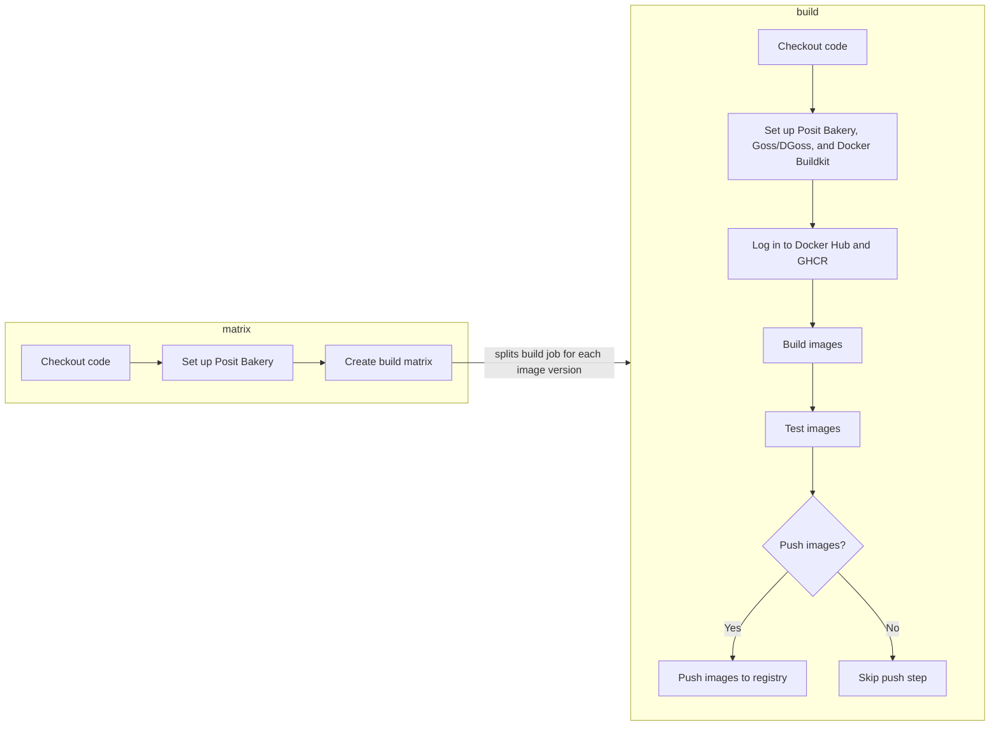

```mermaid
flowchart LR
    subgraph matrix
        checkout[Checkout code] --> setup[Set up Posit Bakery]
        setup --> create_matrix[Create build matrix]
        setup --> create_merge_matrix[Create merge matrix]
    end
    subgraph build_amd64[Build amd64 images]
        checkout2[Checkout code] --> setup2[Set up Posit Bakery, Goss/DGoss, and Docker Buildkit]
        setup2 --> login[Log in to Docker Hub and GHCR]
        login --> bakery_build[Build images]
        bakery_build --> test[Test images]
        test --> push_temp[Push images to temporary registry]
        push_temp --> upload_metadata[Upload build metadata]
    end
    subgraph build_arm64[Build arm64 images]
        checkout3[Checkout code] --> setup3[Set up Posit Bakery, Goss/DGoss, and Docker Buildkit]
        setup3 --> login2[Log in to Docker Hub and GHCR]
        login2 --> bakery_build2[Build images]
        bakery_build2 --> test2[Test images]
        test2 --> push_temp2[Push images to temporary registry]
        push_temp2 --> upload_metadata2[Upload build metadata]
    end
    subgraph merge[Merge and push images]
        download_metadata[Download build metadata] --> pull_images[Pull images from temporary registry]
        pull_images --> merge_images[Merge images from temporary registry]
        merge_images --> push_decision{Push images?}
        push_decision -- Yes --> push[Push images to registries]
        push_decision -- No --> skip[Print images to be merged/pushed and exit]
    end
    create_matrix -.->|"splits by image version and platform"| build_amd64
    create_matrix -.->|"splits by image version and platform"| build_arm64
    upload_metadata -.-> download_metadata
    upload_metadata2 -.-> download_metadata
    push_temp -.-> pull_images
    push_temp2 -.-> pull_images
    create_merge_matrix -.->|"splits by image version"| merge
```

# Bakery CI

## Shared Workflows

This repository provides two Github Action workflows for building, testing, and pushing images:
- `bakery-build.yml` - Builds and tests images using Posit Bakery. Multiplatform images are supported through QEMU emulation.
- `bakery-build-native.yml` - Builds and tests images using Posit Bakery on native hardware and then merges and pushes them. This workflow is intended for use with self-hosted runners that support the target platforms.

### bakery-build.yml

This workflow builds, tests, and optionally pushes all images in a Bakery project. Image targets are split by image and version and built in parallel jobs.

Multiplatform builds are ran using QEMU emulation.

#### Usage

Below is an example workflow implementation that:
- Builds, tests, and pushes all release images on a weekly basis or on merge to `main`.
- Builds, tests, and pushes all development images on a daily basis or on merge to `main`.
- Builds and tests all images for validation purposes for pull requests.

```yaml
on:
  schedule:
    # Weekly rebuild of all images, to pick up any upstream changes.
    - cron: "0 3 * * 0" # At 03:00 on Sunday
    # Daily rebuild of dev images
    - cron: "0 4 * * *" # At 04:00 daily

  pull_request:

  push:
    branches:
      - main

concurrency:
  # Only cancel in-progress runs for pull_request events, this prevents cancelling workflows against main or tags
  # A pull_request will reuse the same group thus enabling cancelation, all others receive a unique run_id
  group: ${{ github.workflow }}-${{ github.event.pull_request.number || github.run_id }}
  cancel-in-progress: true

jobs:
  ci:
    name: CI
    # This should be the only action checked as required in the repo settings.
    #
    # This is a meta-job, here to express the conditions we require
    # in order to consider a CI run to be successful.
    if: always()

    runs-on: ubuntu-latest
    timeout-minutes: 10
    needs:
      - build
      - dev

    steps:
      - uses: re-actors/alls-green@release/v1
        with:
          jobs: ${{ toJSON(needs) }}
          allowed-skips: ${{
              (
                github.event_name == 'schedule' &&
                (
                  github.event.schedule != '0 3 * * 0' && '["build"]'
                  ||
                  github.event.schedule != '0 4 * * *' && '["dev"]'
                )
              ) || '[]'
            }}
  build:
    name: Build
    # Build all images, excluding dev versions.
    #
    # Builds all versions of each image in parallel.
    #
    # Run on merges to main, or on weekly scheduled re-builds.
    if: contains(fromJSON('["push", "pull_request"]'), github.event_name) || github.event.schedule == '0 3 * * 0'
    permissions:
      contents: read
      packages: write

    uses: "posit-dev/images-shared/.github/workflows/bakery-build.yml@main"
    secrets:
      DOCKER_HUB_ACCESS_TOKEN: ${{ secrets.DOCKER_HUB_ACCESS_TOKEN }}
      APP_ID: ${{ secrets.APP_ID }}
      APP_PRIVATE_KEY: ${{ secrets.APP_PRIVATE_KEY }}
    with:
      dev-versions: "exclude"
      # Push images only for merges into main and weekly schduled re-builds.
      push: ${{ github.event_name == 'push' && github.ref == 'refs/heads/main' || github.event.schedule == '0 3 * * 0' }}

  dev:
    name: Dev Build
    # Dev Build
    #
    # Builds all development versions of each image in parallel.
    #
    # Run on merges to main, or on hourly scheduled re-builds.
    if: contains(fromJSON('["push", "pull_request"]'), github.event_name) || github.event.schedule == '0 4 * * *'

    permissions:
      contents: read
      packages: write

    uses: "posit-dev/images-shared/.github/workflows/bakery-build.yml@main"
    secrets:
      APP_ID: ${{ secrets.APP_ID }}
      APP_PRIVATE_KEY: ${{ secrets.APP_PRIVATE_KEY }}
    with:
      dev-versions: "only"
      # Push images only for merges into main and hourly schduled re-builds.
      push: ${{ github.event_name == 'push' && github.ref == 'refs/heads/main' || github.event.schedule == '0 4 * * *' }}
```
#### Inputs
| Input          | Required | Default         | Description                                                                                                    |
|----------------|----------|-----------------|----------------------------------------------------------------------------------------------------------------|
| `version`      | No       | `main`          | The version of Posit Bakery to use. Can be a specific version (e.g., `0.1.0`) or a branch name (e.g., `main`). |
| `context`      | No       | `.`             | The path to the Bakery project root.                                                                           |
| `dev-versions` | No       | `include`       | Whether to include development versions in the build. Options are `include`, `exclude`, and `only`.            |
| `push`         | No       | `false`         | Whether to push built images to the registry.                                                                  |
| `runs-on`      | No       | `ubuntu-latest` | The type of runner to use for the build jobs.                                                                  |

#### Workflow Steps



## bakery-build-native.yml

This workflow builds, tests, and optionally pushes all images in a Bakery project using native hardware. Image targets are split by image, version, and compatible platforms and built in parallel jobs.

Multiplatform builds are built and tested on native hardware, pushed to a temporary registry, and then merged and pushed to their final destination.

### Usage

Below is an example workflow implementation that:
- Builds, tests, and pushes all release images on a weekly basis or on merge to `main`.
- Builds, tests, and pushes all development images on a daily basis or on merge to `main`.
- Builds and tests all images for validation purposes for pull requests.

```yaml
on:
  schedule:
    # Weekly rebuild of all images, to pick up any upstream changes.
    - cron: "0 3 * * 0" # At 03:00 on Sunday
    # Daily rebuild of dev images
    - cron: "0 4 * * *" # At 04:00 daily
  pull_request:
  push:
    branches:
      - main
concurrency:
  # Only cancel in-progress runs for pull_request events, this prevents cancelling workflows against main or tags
  # A pull_request will reuse the same group thus enabling cancelation, all others receive a unique run_id
  group: ${{ github.workflow }}-${{ github.event.pull_request.number || github.run_id }}
  cancel-in-progress: true
jobs:
  ci:
    name: CI
    # This should be the only action checked as required in the repo settings.
    #
    # This is a meta-job, here to express the conditions we require
    # in order to consider a CI run to be successful.
    if: always()
    runs-on: ubuntu-latest
    timeout-minutes: 10
    needs:
      - build
      - dev
    steps:
      - uses: re-actors/alls-green@release/v1
        with:
          jobs: ${{ toJSON(needs) }}
          allowed-skips: ${{
              (
                github.event_name == 'schedule' &&
                (
                  github.event.schedule != '0 3 * * 0' && '["build"]'
                  ||
                  github.event.schedule != '0 4 * * *' && '["dev"]'
                )
              ) || '[]'
            }}
  build:
    name: Build
    # Build all images, excluding dev versions.
    #
    # Builds all versions of each image in parallel.
    #
    # Run on merges to main, or on weekly scheduled re-builds.
    if: contains(fromJSON('["push", "pull_request"]'), github.event_name) || github.event.schedule == '0 3 * * 0'
    permissions:
      contents: read
      packages: write
    uses: "posit-dev/images-shared/.github/workflows/bakery-build-native.yml@main"
    secrets:
      DOCKER_HUB_ACCESS_TOKEN: ${{ secrets.DOCKER_HUB_ACCESS_TOKEN }}
      APP_ID: ${{ secrets.APP_ID }}
      APP_PRIVATE_KEY: ${{ secrets.APP_PRIVATE_KEY }}
    with:
      dev-versions: "exclude"
      # Push images only for merges into main and weekly schduled re-builds.
      push: ${{ github.event_name == 'push' && github.ref == 'refs/heads/main' || github.event.schedule == '0 3 * * 0' }}
  dev:
    name: Dev Build
    # Dev Build
    #
    # Builds all development versions of each image in parallel.
    #
    # Run on merges to main, or on hourly scheduled re-builds.
    if: contains(fromJSON('["push", "pull_request"]'), github.event_name) || github.event.schedule == '0 4 * * *'
    permissions:
      contents: read
      packages: write
    uses: "posit-dev/images-shared/.github/workflows/bakery-build-native.yml@main"
    secrets:
      APP_ID: ${{ secrets.APP_ID }}
      APP_PRIVATE_KEY: ${{ secrets.APP_PRIVATE_KEY }}
    with:
      dev-versions: "only"
      # Push images only for merges into main and hourly schduled re-builds.
      push: ${{ github.event_name == 'push' && github.ref == 'refs/heads/main' || github.event.schedule == '0 4 * * *' }}
```

#### Inputs

| Input           | Required | Default                     | Description                                                                                                    |
|-----------------|----------|-----------------------------|----------------------------------------------------------------------------------------------------------------|
| `version`       | No       | `main`                      | The version of Posit Bakery to use. Can be a specific version (e.g., `0.1.0`) or a branch name (e.g., `main`). |
| `context`       | No       | `.`                         | The path to the Bakery project root.                                                                           |
| `dev-versions`  | No       | `include`                   | Whether to include development versions in the build. Options are `include`, `exclude`, and `only`.            |
| `push`          | No       | `false`                     | Whether to push built images to the registry.                                                                  |
| `runs-on`       | No       | `ubuntu-latest`             | The type of runner to use for non-build jobs.                                                                  |
| `amd64-builder` | No       | `ubuntu-latest-4x`          | The type of runner to use for amd64 build jobs.                                                                |
| `arm64-builder` | No       | `ubuntu-24.04-arm64-4-core` | The type of runner to use for arm64 build jobs.                                                                |

#### Workflow Steps


