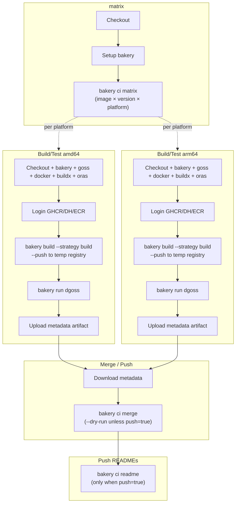
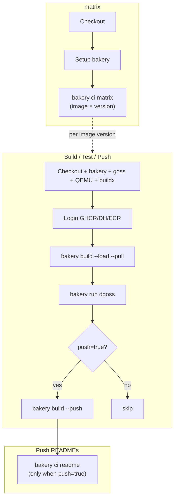

# Bakery CI

This repository provides reusable GitHub Actions workflows and composite actions that build, test, push, lint, release, and clean up Posit container images. The following repositories consume them:

- [images-connect](https://github.com/posit-dev/images-connect)
- [images-package-manager](https://github.com/posit-dev/images-package-manager)
- [images-workbench](https://github.com/posit-dev/images-workbench)
- [images-examples](https://github.com/posit-dev/images-examples)
- [images-specialized](https://github.com/posit-dev/images-specialized)

For the cross-repo dispatch chain (product repo → image repo → helm chart), see [Cross-Repository Workflows](https://posit-dev.github.io/images-shared/cross-repo-workflows.html).

## Reusable workflows

| Workflow | Purpose | Pushes? |
|---|---|---|
| [`bakery-build-native.yml`](#bakery-build-nativeyml) | Multi-platform build on native runners (amd64/arm64), merged with `bakery ci merge`. Primary release path. | Optional (`push: true`) |
| [`bakery-build.yml`](#bakery-buildyml) | Single-runner build using Quick Emulator (QEMU). Simpler but slower than the native variant. Use when native runners are not available. | Optional (`push: true`) |
| [`bakery-build-pr.yml`](#bakery-build-pryml) | Fork-safe pull request (PR) build. Never pushes, and skips arm64 on fork PRs. | Never |
| [`product-release.yml`](#product-releaseyml) | Run on product release dispatch. Creates or patches a bakery version and opens a release PR. | n/a |
| [`clean.yml`](#cleanyml) | Remove old cache images and dangling temporary images from GitHub Container Registry (GHCR). | n/a |
| [`hadolint.yml`](#hadolintyml) | Run hadolint against every rendered Containerfile in the repo. | n/a |

All reusable workflows pin third-party actions to a SHA with a trailing patch-version comment and follow a no-`${{ }}`-in-`run:` policy enforced by [zizmor](https://github.com/zizmorcore/zizmor).

## How consumer repos compose these workflows

### Image product repos (`images-connect`, `images-package-manager`, `images-workbench`)

Each has the same set of caller workflows:

| Caller | Trigger | Calls |
|---|---|---|
| `production.yml` | weekly cron + push to main + dispatch | `bakery-build-native.yml` (`dev-versions=exclude`, `matrix-versions=exclude`) + `clean.yml` |
| `development.yml` | daily cron + push to main + dispatch | `bakery-build-native.yml` (`dev-versions=only`) + `clean.yml` |
| `content.yml` (Posit Connect) and `session.yml` (Posit Workbench) | weekly cron + push to main + dispatch | `bakery-build-native.yml` (`matrix-versions=only`) + `clean.yml` |
| `pr.yml` | `pull_request` | `bakery-build-pr.yml` for each of production, development, and (where applicable) matrix images |
| `release.yml` | `workflow_dispatch` from the product repo via GitHub App | `product-release.yml` |

`pr.yml` also runs repo-local lint and [zizmor](https://github.com/zizmorcore/zizmor) jobs alongside the shared workflow calls.

### `images-examples`

[`images-examples`](https://github.com/posit-dev/images-examples) does not call any of the reusable workflows. It hand-rolls its CI around the [`setup-bakery`](setup-bakery) and [`setup-goss`](setup-goss) composite actions:

| Caller | Trigger | Calls |
|---|---|---|
| `bakery.yaml` | `pull_request` | Collects numbered example directories under `bakery/`, then builds and tests each example via `just --justfile bakery/Justfile`. Uses the `setup-bakery` and `setup-goss` composite actions to install the same toolchain the reusable workflows install. |
| `extending.yaml` | `pull_request` | Discovers `Containerfile*` or `Dockerfile*` under `extending/` and builds each with `docker/build-push-action`. Does not use bakery, because these examples demonstrate extending images without it. |
| `lint.yaml` | `pull_request` + push to main | Pre-commit lint job, no shared workflow or action calls. |

### `images-specialized`

[`images-specialized`](https://github.com/posit-dev/images-specialized) builds Workbench-derived images for cloud workstation services (Google Cloud Workstations and Azure ML). Each image has its own caller workflow rather than rolling up into a shared `production.yml`, and only `pr.yml` calls a shared reusable workflow:

| Caller | Trigger | Calls |
|---|---|---|
| `pr.yml` | `pull_request` | `bakery-build-pr.yml` with `cache: false`, because the images exceed the per-layer cache size limit in GHCR and registry caching silently fails. |
| `waml.yml` (Azure ML), `wgcw.yml` (Google Cloud Workstations) | weekly cron + push to main + dispatch | Hand-rolled matrix → build → test → push pipeline using the [`setup-bakery`](setup-bakery) and [`setup-goss`](setup-goss) composite actions plus direct `bakery build` and `bakery run dgoss` calls. `wgcw.yml` additionally authenticates to Google Cloud Platform (GCP) via OpenID Connect (OIDC) and uses a GCP Artifact Registry (`us-central1-docker.pkg.dev/cloud-workstations-cache`) as its build cache. Each workflow's gating `ci` job calls the [`slack-build-notify`](.github/actions/slack-build-notify) composite action to post build outcomes to Slack. |
| `release.yml` | `workflow_dispatch` | Hand-rolled version-bump workflow using the [`setup-bakery`](setup-bakery) composite action and direct `bakery update version` / `bakery create version` / `bakery remove version` calls. Does not call `product-release.yml`. |

## Cron schedule across consumer repos

The weekly and daily cron triggers in the caller workflows above are staggered so no two consumer repos start a build at the same time. The schedule itself lives in each caller workflow's `on: schedule:` block (all in UTC). This section documents the staggering scheme so future changes stay consistent.

Order (applied identically to the weekly Sunday window and the daily window): `images-package-manager` → `images-connect` → `images-workbench` → `images-specialized`.

**Hour spacing.** Each repo occupies its own hour within a window, so two repos never start a workflow in the same hour. `images-package-manager` has only one weekly workflow (`production`), which occupies its hour alone. Connect, Workbench, and Specialized each fit two workflows into their hour with minute-level spacing.

**Minute spacing within a repo's shared hour.**

- For Connect (`production` + `content`) and Workbench (`production` + `session`), `production` runs first and the matrix workflow runs half an hour later so the matrix images build against a freshly-rebuilt base.
- For `images-specialized`, `wgcw` runs first and `waml` runs half an hour later because `waml` takes significantly longer.

**Daily window.** The daily `development` workflows in Posit Package Manager (PPM), Connect, and Workbench occupy one hour each in the same repo order. The daily window starts a few hours after the weekly window ends, and the gap hours stay empty as headroom for future consumer workflows.

## `bakery-build-native.yml`

Builds, tests, and pushes images on native hardware. Each `{image, version, platform}` combination builds on its own runner and pushes to a temporary GHCR registry. A `merge` job then combines them into multi-platform manifests using `bakery ci merge`, and a `readme` job pushes Docker Hub READMEs after a successful push.

### Inputs

| Input | Required | Default | Description |
|---|---|---|---|
| `version` | No | `main` | Bakery version to install (release tag or branch). |
| `context` | No | `.` | Path to the bakery context (project root). |
| `dev-versions` | No | `exclude` | Dev version filter. One of `include`, `exclude`, `only`. |
| `matrix-versions` | No | `exclude` | Matrix version filter (e.g., R × Python content or session images). One of `include`, `exclude`, `only`. |
| `image-version` | No | `""` | Filter to a specific image version. Bakery strips a leading `v` automatically. |
| `dev-stream` | No | `""` | Filter dev versions to a specific release stream (e.g., `daily`, `preview`). |
| `push` | No | `false` | Push merged manifests to Docker Hub, GHCR, and Amazon Elastic Container Registry (ECR). |
| `retry` | No | `1` | Retry count for a failed build. |
| `cache` | No | `true` | Use the GHCR registry-backed buildx cache. |
| `merge-builder` | No | `ubuntu-latest-4x` | Runner label for the merge job. |
| `amd64-builder` | No | `ubuntu-latest-4x` | Runner label for amd64 build jobs. |
| `arm64-builder` | No | `ubuntu-24.04-arm64-4-core` | Runner label for arm64 build jobs. |
| `aws-region` | No | `us-east-2` | AWS region for ECR login. |

### Secrets

| Secret | Required for |
|---|---|
| `DOCKER_HUB_ACCESS_TOKEN` | Pushing to Docker Hub. |
| `DOCKER_HUB_README_USERNAME` | Pushing READMEs to Docker Hub. The token must be a Personal Access Token (PAT), not an Organization Access Token (OAT). |
| `DOCKER_HUB_README_PASSWORD` | Pushing READMEs to Docker Hub. |
| `AWS_ROLE` | Pushing to ECR (OIDC); also requires `id-token: write` on the caller. |

### Example usage

Weekly production rebuild from `images-connect/.github/workflows/production.yml`:

```yaml
name: Production
on:
  workflow_dispatch:
  schedule:
    - cron: "15 3 * * 0"  # 03:15 Sunday
  push:
    branches: [main]

jobs:
  build:
    permissions:
      contents: read
      packages: write
    uses: posit-dev/images-shared/.github/workflows/bakery-build-native.yml@main
    secrets:
      DOCKER_HUB_ACCESS_TOKEN: ${{ secrets.DOCKER_HUB_ACCESS_TOKEN }}
      DOCKER_HUB_README_USERNAME: ${{ secrets.DOCKER_HUB_README_USERNAME }}
      DOCKER_HUB_README_PASSWORD: ${{ secrets.DOCKER_HUB_README_PASSWORD }}
    with:
      dev-versions: "exclude"
      matrix-versions: "exclude"
      push: ${{ github.event_name == 'push' && github.ref == 'refs/heads/main' || github.event_name == 'schedule' || github.event_name == 'workflow_dispatch' && github.ref == 'refs/heads/main' }}
```

### Workflow steps


```mermaid
flowchart TD
    subgraph matrix
        m_checkout[Checkout] --> m_bakery[Setup bakery]
        m_bakery --> m_matrix["bakery ci matrix<br/>(image × version × platform)"]
    end
    subgraph build_amd64[Build/Test amd64]
        a_setup[Checkout + bakery + goss + docker + buildx + oras] --> a_login[Login GHCR/DH/ECR]
        a_login --> a_build["bakery build --strategy build<br/>--push to temp registry"]
        a_build --> a_test["bakery run dgoss"]
        a_test --> a_meta[Upload metadata artifact]
    end
    subgraph build_arm64[Build/Test arm64]
        r_setup[Checkout + bakery + goss + docker + buildx + oras] --> r_login[Login GHCR/DH/ECR]
        r_login --> r_build["bakery build --strategy build<br/>--push to temp registry"]
        r_build --> r_test["bakery run dgoss"]
        r_test --> r_meta[Upload metadata artifact]
    end
    subgraph merge[Merge / Push]
        m_dl[Download metadata] --> m_merge["bakery ci merge<br/>(--dry-run unless push=true)"]
    end
    subgraph readme[Push READMEs]
        r_run["bakery ci readme<br/>(only when push=true)"]
    end
    m_matrix -.->|"per platform"| build_amd64
    m_matrix -.->|"per platform"| build_arm64
    a_meta --> m_dl
    r_meta --> m_dl
    m_merge --> r_run
```

## `bakery-build.yml`

Builds, tests, and optionally pushes images on a single runner using QEMU for cross-platform builds. Slower than `bakery-build-native.yml` but does not require native arm64 runners. Each `{image, version}` runs on its own job, and buildx produces multi-platform manifests in a single push step.

### Inputs

| Input | Required | Default | Description |
|---|---|---|---|
| `version` | No | `main` | Bakery version to install. |
| `context` | No | `.` | Path to the bakery context. |
| `dev-versions` | No | `exclude` | Dev version filter (`include`, `exclude`, `only`). |
| `matrix-versions` | No | `exclude` | Matrix version filter (`include`, `exclude`, `only`). |
| `image-version` | No | `""` | Filter to a specific image version. Leading `v` is stripped. |
| `dev-stream` | No | `""` | Filter dev versions to a specific release stream. |
| `push` | No | `false` | Push images to registries. |
| `retry` | No | `1` | Retry count for a failed build. |
| `cache` | No | `true` | Use the GHCR registry-backed buildx cache. |
| `runs-on` | No | `ubuntu-latest` | Runner label for build jobs. |
| `aws-region` | No | `us-east-2` | AWS region for ECR login. |

### Secrets

Same as [`bakery-build-native.yml`](#bakery-build-nativeyml): `DOCKER_HUB_ACCESS_TOKEN`, `DOCKER_HUB_README_USERNAME`, `DOCKER_HUB_README_PASSWORD`, `AWS_ROLE`.

### Workflow steps


```mermaid
flowchart TD
    subgraph matrix
        m_checkout[Checkout] --> m_bakery[Setup bakery]
        m_bakery --> m_matrix["bakery ci matrix<br/>(image × version)"]
    end
    subgraph build[Build / Test / Push]
        b_setup[Checkout + bakery + goss + QEMU + buildx] --> b_login[Login GHCR/DH/ECR]
        b_login --> b_build["bakery build --load --pull"]
        b_build --> b_test["bakery run dgoss"]
        b_test --> b_push{"push=true?"}
        b_push -- yes --> b_pushrun["bakery build --push"]
        b_push -- no --> b_skip[skip]
    end
    subgraph readme[Push READMEs]
        r_run["bakery ci readme<br/>(only when push=true)"]
    end
    m_matrix -.->|"per image version"| build
    b_pushrun --> r_run
```

## `bakery-build-pr.yml`

Fork-safe variant for pull requests. Inherits only `GITHUB_TOKEN`, never pushes, and skips arm64 jobs on fork PRs (paid arm64 runners might not be available). Runs the same build + dgoss test on each `{image, version, platform}` combination.

### Inputs

| Input | Required | Default | Description |
|---|---|---|---|
| `version` | No | `main` | Bakery version to install. |
| `context` | No | `.` | Path to the bakery context. |
| `dev-versions` | No | `exclude` | Dev version filter (`include`, `exclude`, `only`). |
| `matrix-versions` | No | `exclude` | Matrix version filter (`include`, `exclude`, `only`). |
| `retry` | No | `1` | Retry count for a failed build. |
| `cache` | No | `true` | Use registry caching (disabled automatically on fork PRs). |
| `amd64-builder` | No | `ubuntu-latest-4x` | Runner label for amd64 builds. |
| `arm64-builder` | No | `ubuntu-24.04-arm64-4-core` | Runner label for arm64 builds. |

No secrets. This workflow intentionally has no `secrets:` block.

### Example usage

From a product repo's `pr.yml`:

```yaml
name: Pull Request
on:
  pull_request:

jobs:
  production:
    permissions:
      contents: read
      packages: write
    uses: posit-dev/images-shared/.github/workflows/bakery-build-pr.yml@main
    with:
      dev-versions: "exclude"
      matrix-versions: "exclude"

  development:
    permissions:
      contents: read
      packages: write
    uses: posit-dev/images-shared/.github/workflows/bakery-build-pr.yml@main
    with:
      dev-versions: "only"
      matrix-versions: "exclude"

  content:
    permissions:
      contents: read
      packages: write
    uses: posit-dev/images-shared/.github/workflows/bakery-build-pr.yml@main
    with:
      matrix-versions: "only"
```

## `product-release.yml`

Called by an image repo's `release.yml` when a product release is dispatched (typically from the product source repo via a GitHub App). Creates or patches a version in `bakery.yaml`, optionally promotes it to `latest`, rewrites version strings in `README.md` files, and opens a release PR.

### Inputs

| Input | Required | Default | Description |
|---|---|---|---|
| `version` | Yes | — | Full product version (e.g., `2026.03.0`, `2026.02.1+500.pro12`, `2025.12.0-14`). |
| `images` | Yes | — | Space-separated list of versioned (non-matrix) image names to update. |

### Secrets

| Secret | Required for |
|---|---|
| `APP_ID` | GitHub App used to push the release branch and open the PR. |
| `APP_PRIVATE_KEY` | Private key for the GitHub App. |

### Example usage

From `images-connect/.github/workflows/release.yml`:

```yaml
name: Release
on:
  workflow_dispatch:
    inputs:
      version:
        description: "Product version (e.g. 2026.03.0)"
        required: true
        type: string

jobs:
  release:
    permissions:
      contents: write
      pull-requests: write
    uses: posit-dev/images-shared/.github/workflows/product-release.yml@main
    with:
      version: ${{ inputs.version }}
      images: "connect connect-content-init"
    secrets:
      APP_ID: ${{ secrets.POSIT_CONNECT_PROJECTS_APP_ID }}
      APP_PRIVATE_KEY: ${{ secrets.POSIT_CONNECT_PROJECTS_PEM }}
```

### Behavior

For each image listed in `images`:

- Bakery parses the version into a display version (e.g., `2026.03.0`) and an edition or subpath (e.g., `2026.03`).
- If a version already exists for that edition, `bakery update version` patches it in place.
- Otherwise, `bakery create version` creates a new version. Bakery marks it `--mark-latest` if its edition is newer than the current latest, and `--no-mark-latest` otherwise.

When the latest display version changes, the workflow rewrites the old version (and old edition, when it differs) in every `README.md` in the repo, force-pushes a release branch (`release/<display-version>`), and opens a PR against `main`.

## `clean.yml`

Cleans the GHCR cache registry and the temporary registry that `bakery-build-native.yml` uses for cross-platform manifests. Typically called after a build workflow to keep storage bounded.

### Inputs

| Input | Required | Default | Description |
|---|---|---|---|
| `version` | No | `main` | Bakery version to install. |
| `context` | No | `.` | Path to the bakery context. |
| `clean-caches` | No | `true` | Run the `clean-caches` job. |
| `remove-dangling-caches` | No | `true` | Delete untagged cache entries. |
| `remove-caches-older-than` | No | `14` | Delete caches older than this many days. |
| `clean-temporary-images` | No | `true` | Run the `clean-temp` job. |
| `remove-dangling-temporary-images` | No | `false` | Delete untagged temporary images. |
| `remove-temporary-images-older-than` | No | `3` | Delete temporary images older than this many days. |
| `dev-versions` | No | `exclude` | Dev version filter for which images' caches/temps to scan. |
| `matrix-versions` | No | `exclude` | Matrix version filter for which images' caches/temps to scan. |
| `dry-run` | No | `false` | Print what would be deleted without deleting. |

### Secrets

| Secret | Required for |
|---|---|
| `DOCKER_HUB_ACCESS_TOKEN` | Reserved for future Docker Hub cleanup (unused). |

### Example usage

From `images-connect/.github/workflows/production.yml`:

```yaml
clean:
  if: always() && github.ref == 'refs/heads/main'
  permissions:
    contents: read
    packages: write
  needs: [build]
  uses: posit-dev/images-shared/.github/workflows/clean.yml@main
  with:
    remove-dangling-caches: true
    remove-caches-older-than: 14
    remove-dangling-temporary-images: false
    remove-temporary-images-older-than: 3
```

## `hadolint.yml`

Runs [hadolint](https://github.com/hadolint/hadolint) against every rendered Containerfile that `bakery` knows about, including matrix and dev versions.

### Inputs

| Input | Required | Default | Description |
|---|---|---|---|
| `version` | No | `main` | Bakery version to install. |
| `hadolint-version` | No | `latest` | Hadolint release version (e.g., `v2.12.0`). |
| `context` | No | `.` | Path to the bakery context. |

No secrets.
