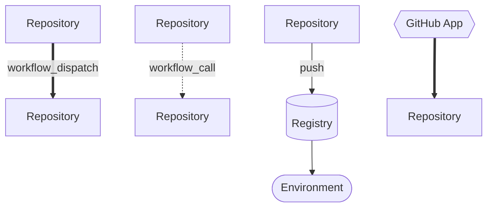
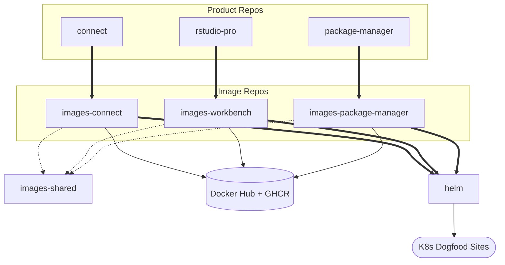
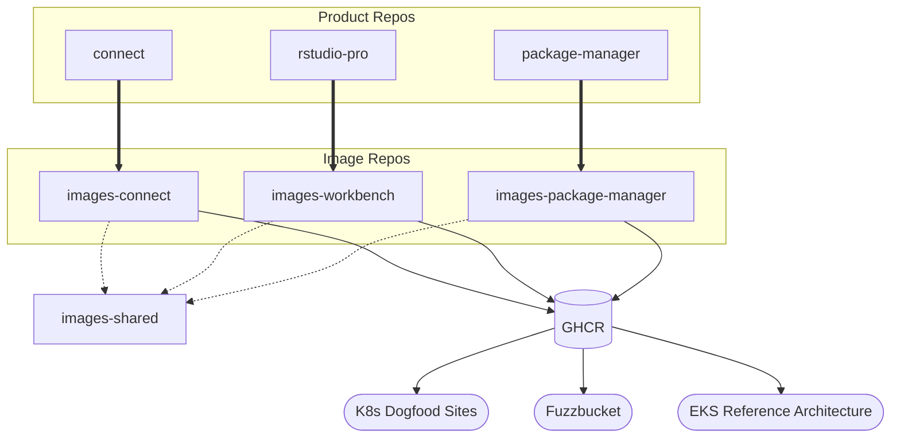
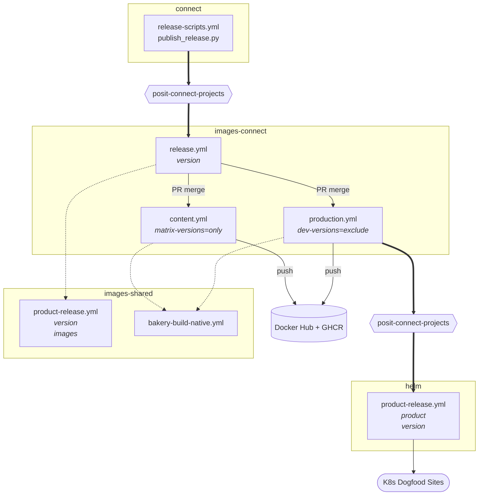
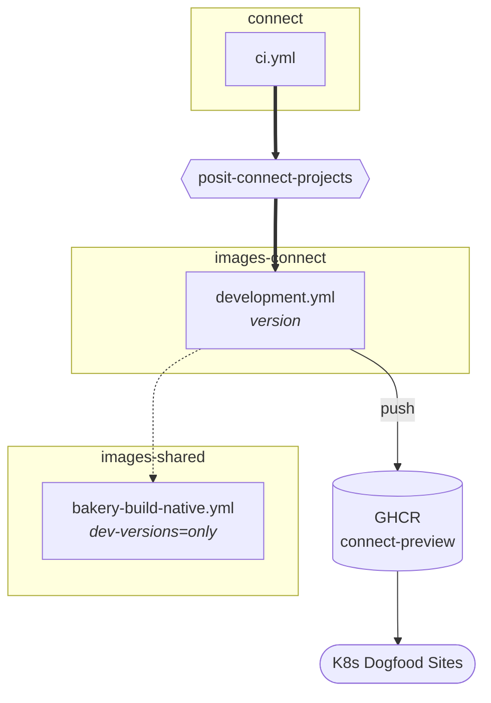
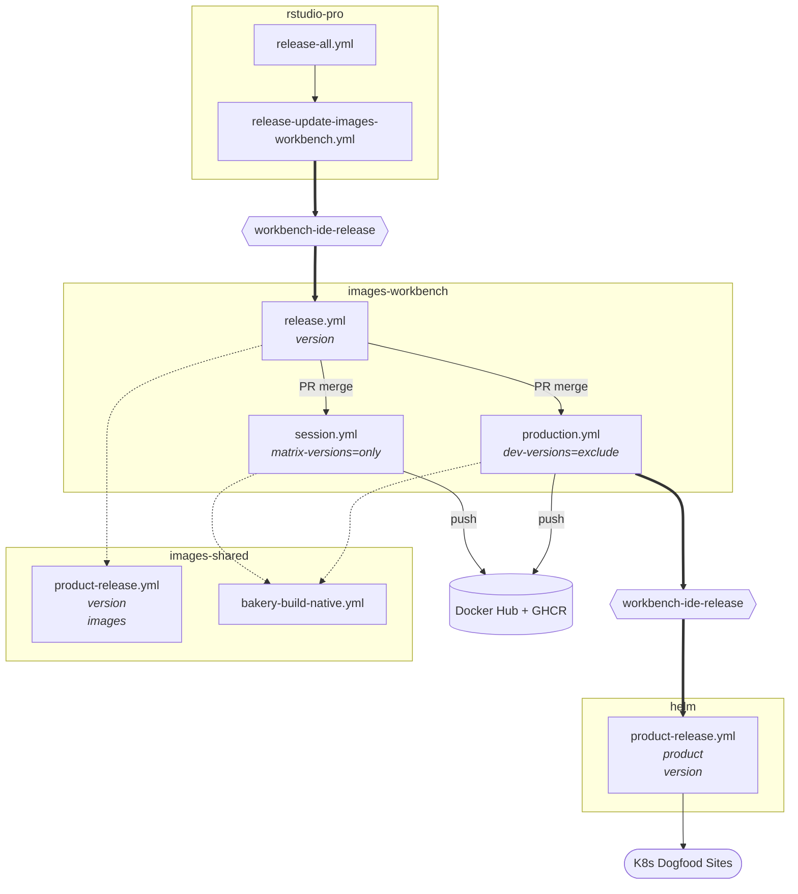
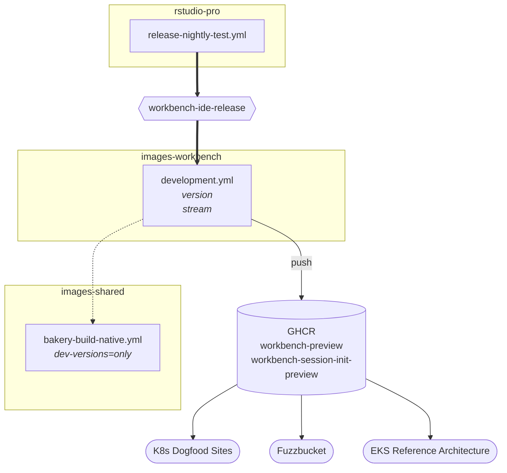
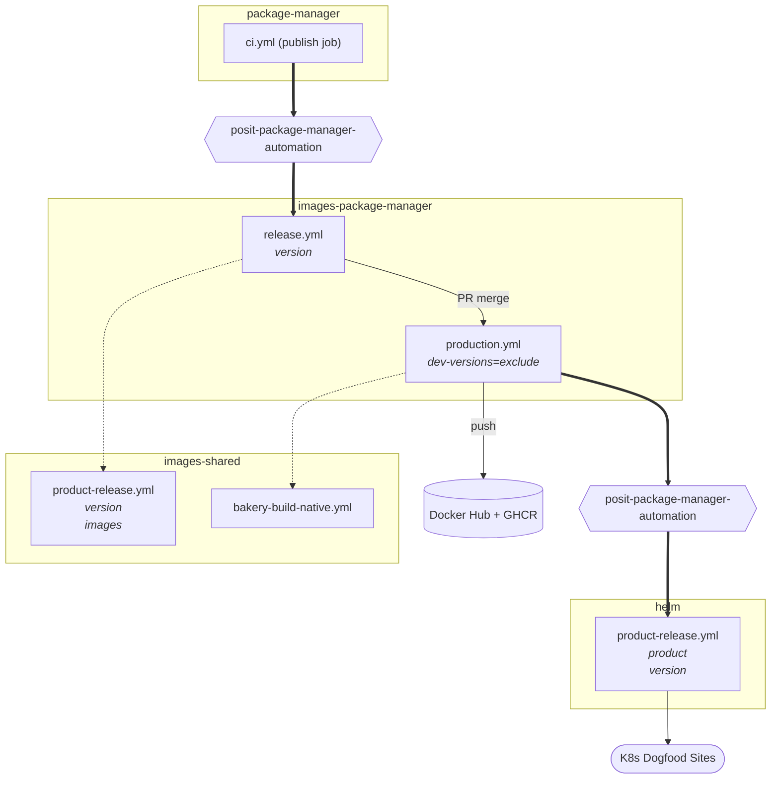
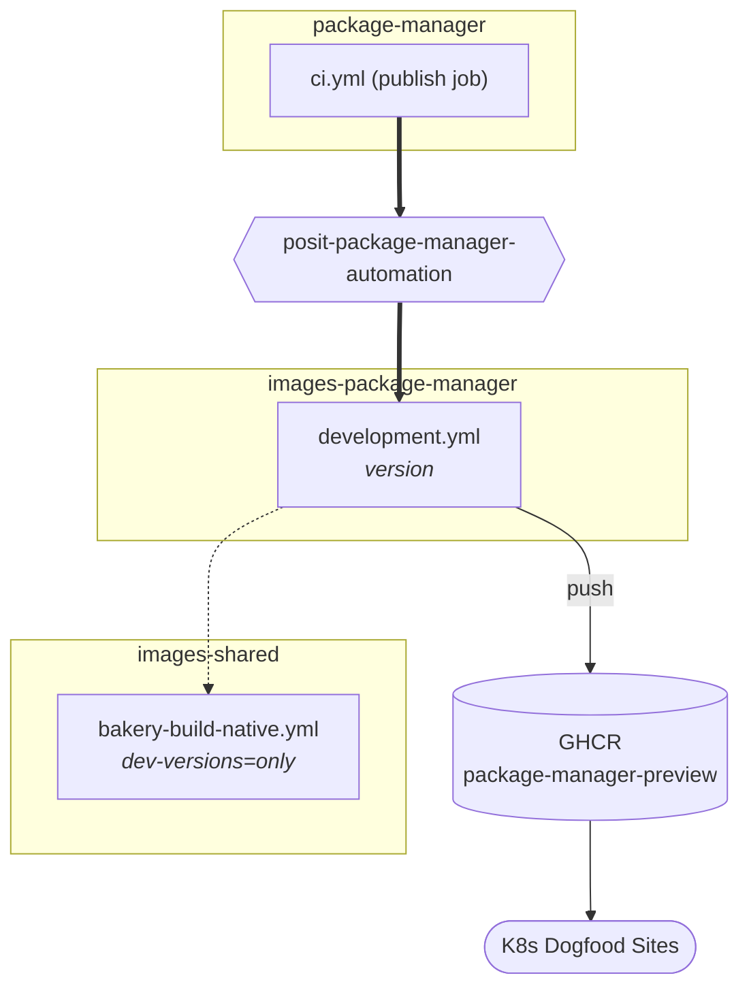

# Cross-repository workflows

Repository relationships and workflow dispatch chains for the Posit container image ecosystem, including dogfooding and internal deployment paths.

For the reusable workflows that these dispatch chains call (inputs, secrets, examples), see [`CI.md`](./CI.md).

## Legend

| Symbol | Meaning |
|---|---|
| Thick line | `workflow_dispatch` (cross-repo trigger via GitHub App) |
| Dashed line | `workflow_call` (reusable workflow in the same CI run) |
| Thin line | Direct action: push, Flux sync, or pull request merge |
| Rectangle | Repository or workflow |
| Cylinder | Registry |
| Stadium | Environment |
| Hexagon | GitHub App identity |

### GitHub Apps

| App | Installed on | Role |
|---|---|---|
| **posit-connect-projects** | `posit-dev/connect` `posit-dev/images-connect` `rstudio/helm` | Dispatches downstream from Posit Connect releases |
| **workbench-ide-release** | `posit-dev/images-workbench` `rstudio/rstudio-pro` `rstudio/helm` | Dispatches downstream from Posit Workbench releases |
| **posit-package-manager-automation** | `posit-dev/images-package-manager` `rstudio/package-manager` `rstudio/helm` | Dispatches downstream from Posit Package Manager (PPM) releases |
| **posit-platform** | `posit-dev/images-shared` `rstudio/helm` | Platform team operations, centralized dispatch |

Product GitHub Apps own the dispatch chain from product release through to Helm chart update. `posit-platform` handles platform-team-owned operations (e.g., scheduled rebuilds, cache cleanup).

## Production release flow

## Development and preview flow

## Per-product diagrams

### Connect

#### Production

Source files:

- [`release-scripts.yml`](https://github.com/posit-dev/connect/blob/main/.github/workflows/release-scripts.yml) (connect)
- [`release.yml`](https://github.com/posit-dev/images-connect/blob/main/.github/workflows/release.yml) (images-connect)
- [`production.yml`](https://github.com/posit-dev/images-connect/blob/main/.github/workflows/production.yml) (images-connect)
- [`content.yml`](https://github.com/posit-dev/images-connect/blob/main/.github/workflows/content.yml) (images-connect)
- [`product-release.yml`](https://github.com/posit-dev/images-shared/blob/main/.github/workflows/product-release.yml) (images-shared)
- [`bakery-build-native.yml`](https://github.com/posit-dev/images-shared/blob/main/.github/workflows/bakery-build-native.yml) (images-shared)
- [`product-release.yml`](https://github.com/rstudio/helm/blob/main/.github/workflows/product-release.yml) (helm)

#### Development

Source files:

- [`ci.yml`](https://github.com/posit-dev/connect/blob/main/.github/workflows/ci.yml) (connect)
- [`development.yml`](https://github.com/posit-dev/images-connect/blob/main/.github/workflows/development.yml) (images-connect)
- [`bakery-build-native.yml`](https://github.com/posit-dev/images-shared/blob/main/.github/workflows/bakery-build-native.yml) (images-shared)

### Workbench

#### Production

Source files:

- [`release-all.yml`](https://github.com/rstudio/rstudio-pro/blob/main/.github/workflows/release-all.yml) (rstudio-pro)
- [`release-update-images-workbench.yml`](https://github.com/rstudio/rstudio-pro/blob/main/.github/workflows/release-update-images-workbench.yml) (rstudio-pro)
- [`release.yml`](https://github.com/posit-dev/images-workbench/blob/main/.github/workflows/release.yml) (images-workbench)
- [`production.yml`](https://github.com/posit-dev/images-workbench/blob/main/.github/workflows/production.yml) (images-workbench)
- [`session.yml`](https://github.com/posit-dev/images-workbench/blob/main/.github/workflows/session.yml) (images-workbench)
- [`product-release.yml`](https://github.com/posit-dev/images-shared/blob/main/.github/workflows/product-release.yml) (images-shared)
- [`bakery-build-native.yml`](https://github.com/posit-dev/images-shared/blob/main/.github/workflows/bakery-build-native.yml) (images-shared)
- [`product-release.yml`](https://github.com/rstudio/helm/blob/main/.github/workflows/product-release.yml) (helm)

#### Development

Source files:

- [`release-nightly-test.yml`](https://github.com/rstudio/rstudio-pro/blob/main/.github/workflows/release-nightly-test.yml) (rstudio-pro)
- [`development.yml`](https://github.com/posit-dev/images-workbench/blob/main/.github/workflows/development.yml) (images-workbench)
- [`bakery-build-native.yml`](https://github.com/posit-dev/images-shared/blob/main/.github/workflows/bakery-build-native.yml) (images-shared)

### Package Manager

#### Production

Source files:

- [`ci.yml`](https://github.com/rstudio/package-manager/blob/main/.github/workflows/ci.yml) (package-manager)
- [`release.yml`](https://github.com/posit-dev/images-package-manager/blob/main/.github/workflows/release.yml) (images-package-manager)
- [`production.yml`](https://github.com/posit-dev/images-package-manager/blob/main/.github/workflows/production.yml) (images-package-manager)
- [`product-release.yml`](https://github.com/posit-dev/images-shared/blob/main/.github/workflows/product-release.yml) (images-shared)
- [`bakery-build-native.yml`](https://github.com/posit-dev/images-shared/blob/main/.github/workflows/bakery-build-native.yml) (images-shared)
- [`product-release.yml`](https://github.com/rstudio/helm/blob/main/.github/workflows/product-release.yml) (helm)

#### Development

Source files:

- [`ci.yml`](https://github.com/rstudio/package-manager/blob/main/.github/workflows/ci.yml) (package-manager)
- [`development.yml`](https://github.com/posit-dev/images-package-manager/blob/main/.github/workflows/development.yml) (images-package-manager)
- [`bakery-build-native.yml`](https://github.com/posit-dev/images-shared/blob/main/.github/workflows/bakery-build-native.yml) (images-shared)
