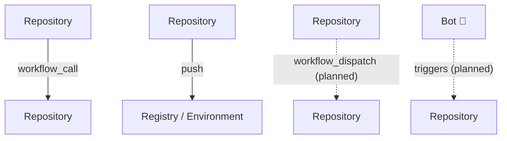
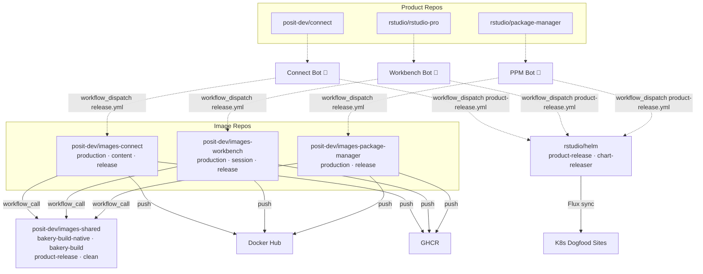
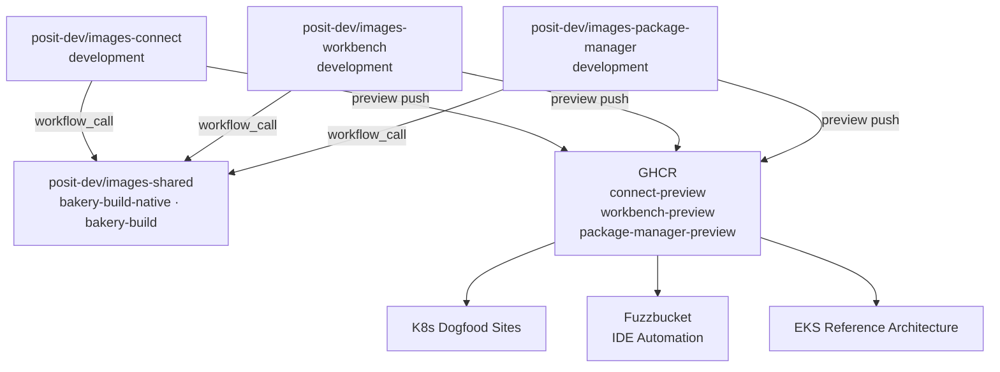

# Cross-Repository Workflow DAG

Repository relationships and workflow dispatch chains for the Posit container
image ecosystem, including dogfooding and internal deployment paths.

Related issues:
- posit-dev/images-shared#279 — Consume `package-manager-preview` image in Dogfood
- posit-dev/images-shared#280 — Workbench dogfood/CI consumes preview images
- posit-dev/images-shared#219 — Automatically deploy images to K8s using Helm
- posit-dev/images-shared#302 — Add `workflow_dispatch` support to image CI workflows

## Legend

| Symbol | Meaning |
|---|---|
| Solid line | Active today |
| Dashed line | Planned / in progress |
| `workflow_call` | Reusable workflow invocation (same run) |
| `workflow_dispatch` | Cross-repo trigger via GitHub App |
| `push` | Image push to registry |
| `Flux sync` | GitOps pull from Helm chart repo |
| 🤖 | GitHub App bot identity |

### GitHub Apps

| Bot | Scope | Role |
|---|---|---|
| **Connect Bot** 🤖 | `posit-dev/connect` | Dispatches downstream from Connect releases |
| **Workbench Bot** 🤖 | `rstudio/rstudio-pro` | Dispatches downstream from Workbench releases |
| **PPM Bot** 🤖 | `rstudio/package-manager` | Dispatches downstream from PPM releases |
| **Platform Bot** 🤖 | `posit-dev/images-*`, `rstudio/helm` | Platform team operations, centralized dispatch (future) |

Product bots own the dispatch chain from product release through to Helm
chart update. The Platform Bot handles platform-team-owned operations
(e.g., scheduled rebuilds, cache cleanup). Centralized dispatch through the
Platform Bot is a future option once the per-product chains are stable.

## Production Release Flow

## Development / Preview Flow

## Repositories Involved in Deployment

| Repository | Role | Deploy Target |
|---|---|---|
| `posit-dev/images-connect` | Build Connect images | Docker Hub, GHCR |
| `posit-dev/images-workbench` | Build Workbench images | Docker Hub, GHCR |
| `posit-dev/images-package-manager` | Build PPM images | Docker Hub, GHCR |
| `posit-dev/images-shared` | Shared build workflows | — |
| `rstudio/helm` | Helm charts for all products | K8s dogfood (Flux) |
| `rstudio/helm-package-manager` | Legacy PPM Helm chart (retiring) | K8s dogfood (Flux) |

### External Repos (Product Source)

| Repository | Trigger Mechanism |
|---|---|
| `posit-dev/connect` | `publish_release.py` dispatches downstream |
| `rstudio/rstudio-pro` | `release-all.yml` dispatches sub-workflows |
| `rstudio/package-manager` | Tag push triggers `ci.yml` publish job |

### Internal Environments

| Environment | Consumes | Source |
|---|---|---|
| K8s Dogfood | PPM preview, Workbench preview, Helm charts | GHCR, Flux |
| Fuzzbucket | Workbench session images | GHCR |
| EKS Reference Architecture | Workbench images | GHCR |
