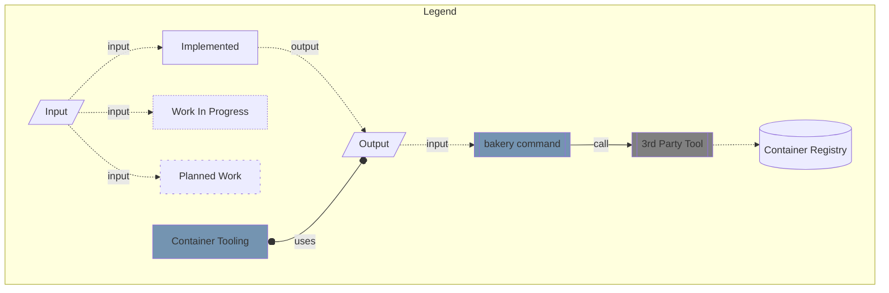
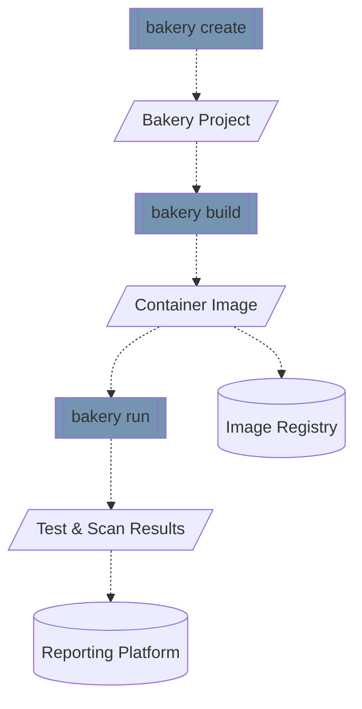
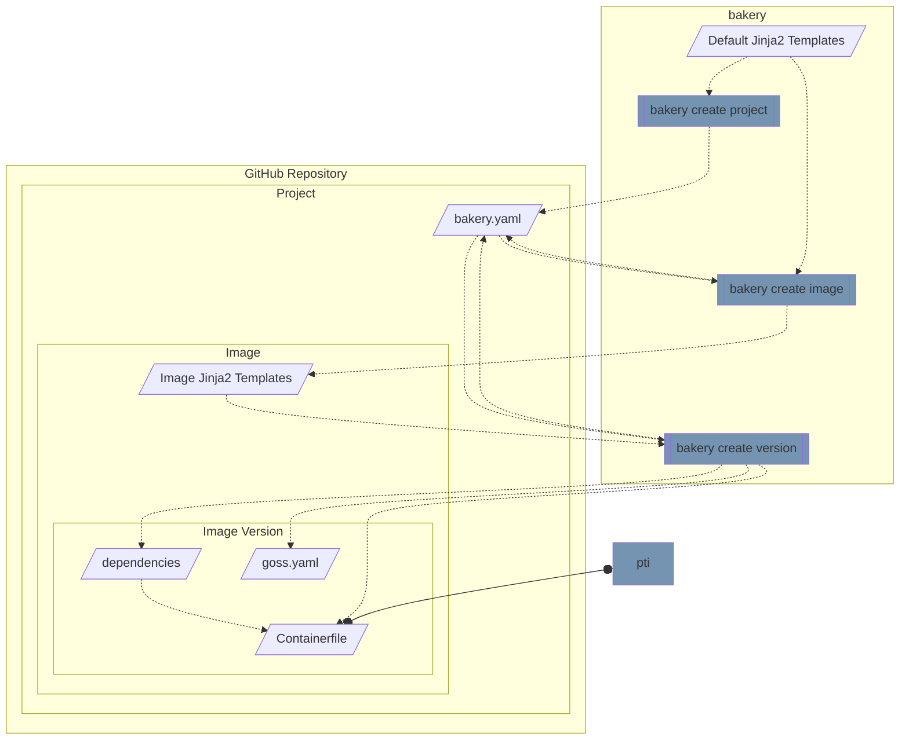
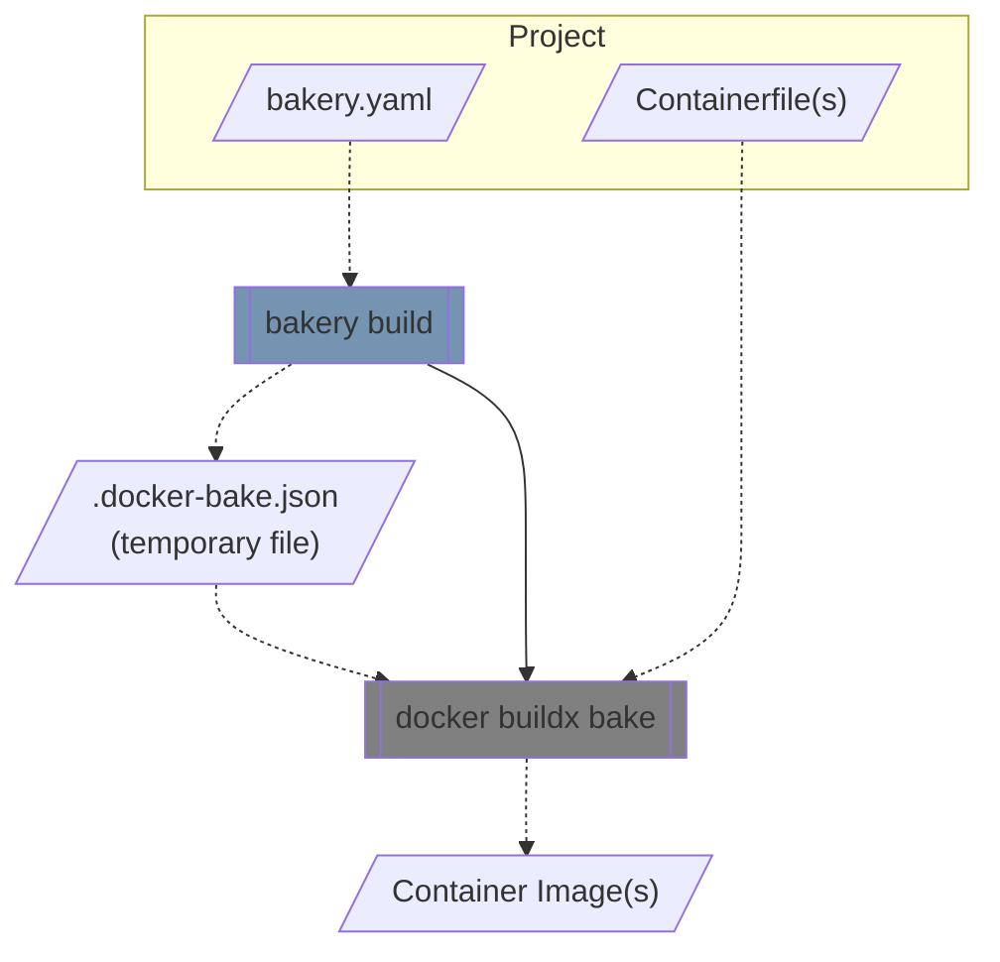
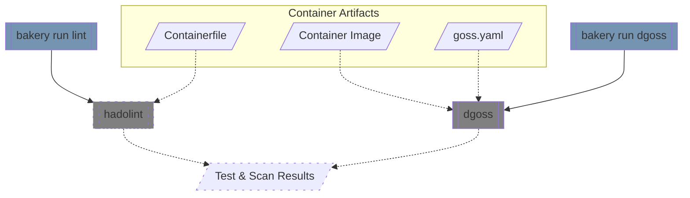
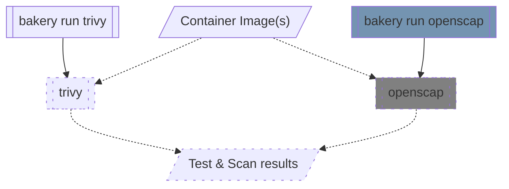
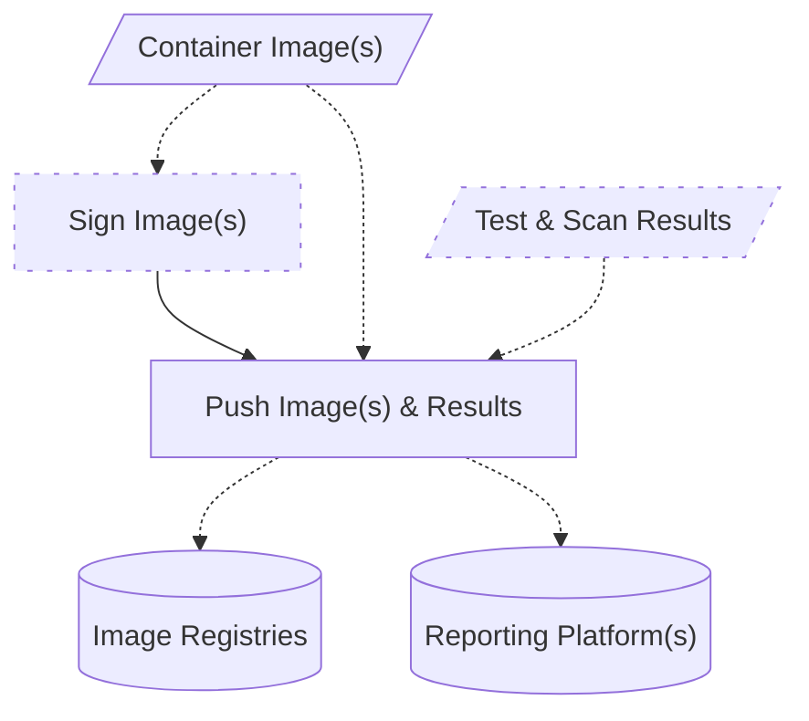

# Bakery Architecture

## Process Diagrams

### Legend

```mermaid
flowchart TB

    subgraph Legend
        input[/"Input"/]
        output[/"Output"/]
        implemented["Implemented"]
        inprogress["Work In Progress"]
        planned["Planned Work"]
        bakery[["bakery command"]]
        external[["3rd Party Tool"]]
        tool["Container Tooling"]
        reg[("Container Registry")]

        input -. "input" .-> implemented -. "output" .-> output
        input -. "input" .-> inprogress
        input -. "input" .-> planned
        tool o-- "uses" --o output
        output -. "input" .-> bakery
        bakery -- "call" --> external -.-> reg
    end

    classDef tooling fill:#7494B1
    classDef external fill:grey
    classDef progress stroke-dasharray: 2 2
    classDef todo stroke-dasharray: 3 8

    class bakery,tool,pti tooling
    class external external
    class inprogress progress
    class planned todo
```

### Workflow

```mermaid
flowchart TD

    create[["bakery create"]]
    project[/Bakery Project/]
    create -.-> project

    build[["bakery build"]]
    image[/Container Image/]
    project -.-> build -.-> image

    run[["bakery run"]]
    results[/"Test & Scan Results"/]
    image -.-> run -.-> results

    reg[(Image Registry)]
    sec[(Reporting Platform)]

    image -.-> reg
    results -.-> sec

    classDef tooling fill:#7494B1
    classDef external fill:grey
    classDef progress stroke-dasharray: 2 2
    classDef todo stroke-dasharray: 3 8

    class create,build,run tooling
    class push external
    class inprogress progress
    class planned todo
```

### Create

```mermaid
flowchart TD

    subgraph "bakery"
        direction TB

        templatesDefault[/Default Jinja2 Templates/]
        createProject[[bakery create project]]
        createImage[[bakery create image]]
        createVersion[[bakery create version]]
    end

    subgraph "GitHub Repository"
        direction TB
        subgraph "Project"
            config[/bakery.yaml/]

            subgraph "Image"
                templatesImage[/Image Jinja2 Templates/]

                subgraph "Image Version"
                    containerfile[/Containerfile/]

                    deps[/dependencies/]
                    tests[/goss.yaml/]
                end
                deps -.-> containerfile
            end
        end

        templatesDefault -.-> createProject -.-> config

        config -.-> createImage
        createImage -.-> config
        templatesDefault -.-> createImage -.-> templatesImage

        templatesImage -.-> createVersion -.-> tests & deps & containerfile
        createVersion -.-> config
        config -.-> createVersion
    end

    pti[pti]
    pti o--o containerfile

    classDef tooling fill:#7494B1
    classDef external fill:grey
    classDef progress stroke-dasharray: 2 2
    classDef todo stroke-dasharray: 3 8

    class pti,createProject,createImage,createVersion tooling
```

### Build

```mermaid
flowchart TD

    subgraph "Project"
        direction LR

        config[/"bakery.yaml"/]
        containerfile[/"Containerfile(s)"/]
    end

    build[[bakery build]]
    plan[/".docker-bake.json<br/>(temporary file)"/]
    bake[[docker buildx bake]]
    image[/"Container Image(s)"/]

    config -.-> build -.-> plan
    plan & containerfile -.-> bake
    build --> bake -.-> image

    classDef tooling fill:#7494B1
    classDef external fill:grey
    classDef progress stroke-dasharray: 2 2
    classDef todo stroke-dasharray: 3 8

    class build tooling
    class bake external
```

### Run Tests

```mermaid
flowchart TD

    subgraph "Container Artifacts"
        direction LR
        containerfile[/Containerfile/]
        tests[/goss.yaml/]
        image[/Container Image/]
    end


    results[/"Test & Scan Results"/]

    lint[[hadolint]]
    runLint[[bakery run lint]]
    runLint --> lint
    containerfile -.-> lint -.-> results

    dgoss[[dgoss]]
    runDgoss[[bakery run dgoss]]
    image & tests -.-> dgoss
    runDgoss --> dgoss
    dgoss -.-> results

    classDef tooling fill:#7494B1
    classDef external fill:grey
    classDef progress stroke-dasharray: 2 2
    classDef todo stroke-dasharray: 3 8

    class runLint,runDgoss tooling
    class lint,dgoss external

    %% Mark what we are working on and is in flight %%
    class inprogress,snyk progress
    class planned,lint,openscap,results todo
```

### Run Security Scans

```mermaid
flowchart TD

    image[/"Container Image(s)"/]
    results[/"Test & Scan results"/]

    trivy[[trivy]]
    runTrivy[[bakery run trivy]]
    runTrivy --> trivy
    image -.-> trivy -.-> results

    openscap[[openscap]]
    runOpenscap[[bakery run openscap]]
    runOpenscap --> openscap
    image -.-> openscap -.-> results

    classDef tooling fill:#7494B1
    classDef external fill:grey
    classDef progress stroke-dasharray: 2 2
    classDef todo stroke-dasharray: 3 8

    class runSnyk,runOpenscap tooling
    class snyk,openscap external

    %% Mark what we are working on and is in flight %%
    class inprogress,trivy todo
    class openscap,results todo
```

### Publish

```mermaid
flowchart TD

    image[/"Container Image(s)"/]
    results[/"Test & Scan Results"/]

    sign["Sign Image(s)"]
    push["Push Image(s) & Results"]
    image -.-> sign --> push

    reg[("Image Registries")]
    sec[("Reporting Platform(s)")]
    image -.-> push -.-> reg
    results -.-> push -.-> sec

    classDef tooling fill:#7494B1
    classDef external fill:grey
    classDef progress stroke-dasharray: 2 2
    classDef todo stroke-dasharray: 3 8

    %% Mark what we are working on and is in flight %%
    class results,sign todo
```
