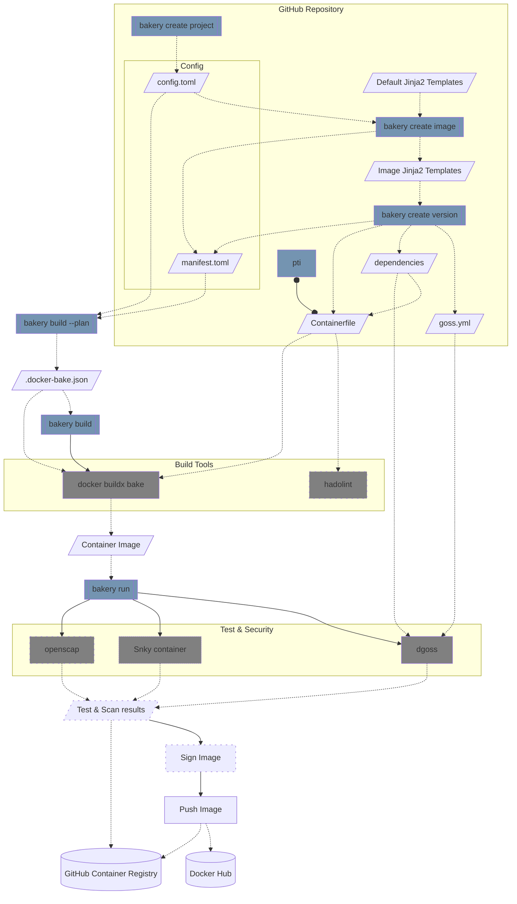
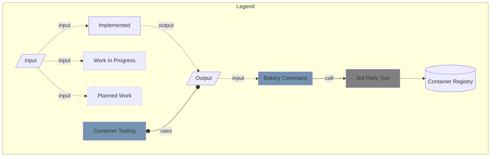

# Bake Tools

Tools for extracting and manipulating artifacts from Docker's buildx bake tool.

## Posit Bakery

---

### Process Diagram

```mermaid

flowchart TB
    subgraph "GitHub Repository"
        direction LR

        templatesDefault[/Default Jinja2 Templates/]

        subgraph "Config"
            direction LR

            config[/config.toml/]
            manifest[/manifest.toml/]
        end

        createProject[[bakery create project]]
        createProject -.-> config
        createImage[[bakery create image]]
        templatesImage[/Image Jinja2 Templates/]

        config -.-> createImage -.-> manifest
        templatesDefault -.-> createImage -.-> templatesImage

        createVersion[[bakery create version]]

        containerfile[/Containerfile/]
        tests[/goss.yml/]
        deps[/dependencies/]
        deps -.-> containerfile
        templatesImage -.-> createVersion -.-> manifest & tests & deps & containerfile

        pti[pti]
        pti o--o containerfile

    end

    buildPlan[[bakery build --plan]]

    plan[/.docker-bake.json/]
    manifest & config -.-> buildPlan -.-> plan

    buildImage[[bakery build]]
    image[/Container Image/]

    subgraph Build Tools
        direction LR

        lint[hadolint]
        bake[docker buildx bake]
    end

    containerfile -.-> lint

    plan -.-> buildImage --> bake -.-> image

    plan & containerfile -.-> bake

    subgraph "Test & Security"
        direction LR

        dgoss[dgoss]
        snyk[Snky container]
        openscap
    end

    tests & deps -.-> dgoss

    run[[bakery run]]
    results[/"Test & Scan results"/]

    image -.-> run --> dgoss & snyk & openscap -.-> results

    sign[Sign Image]
    push[Push Image]
    results --> sign --> push

    docker[(Docker Hub)]
    ghcr[(GitHub Container Registry)]
    push -.-> docker & ghcr
    results -.-> ghcr

    classDef tooling fill:#7494B1
    classDef external fill:grey
    classDef progress stroke-dasharray: 2 2
    classDef todo stroke-dasharray: 3 8

    class pti,createProject,createImage,createVersion tooling
    class buildPlan,buildImage,run tooling

    class lint,bake,dgoss,snyk,openscap external

    %% Mark what we are working on and is in flight %%
    class inprogress,snyk progress
    class planned,lint,openscap,results,sign todo

```

### Diagram Legend

```mermaid
flowchart TB

    subgraph Legend
        input[/"Input"/]
        output[/"Output"/]
        implemented["Implemented"]
        inprogress["Work In Progress"]
        planned["Planned Work"]
        bakery[["Bakery Command"]]
        external["3rd Party Tool"]
        tool["Container Tooling"]
        reg[("Container Registry")]

        input -. "input" .-> implemented -. "output" .-> output
        input -. "input" .-> inprogress
        input -. "input" .-> planned
        tool o-- "uses" --o output
        output -. "input" .-> bakery
        bakery -- "call" --> external -.-> reg
    end


    classDef tooling fill:#7494B1
    classDef external fill:grey
    classDef progress stroke-dasharray: 2 2
    classDef todo stroke-dasharray: 3 8


    class bakery,tool,pti tooling
    class external external
    class inprogress progress
    class planned todo
```
