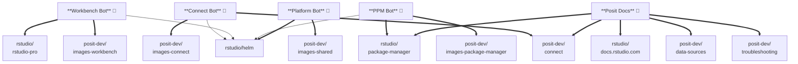
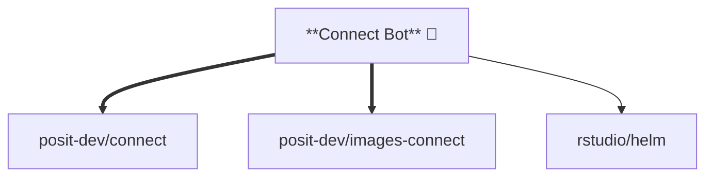
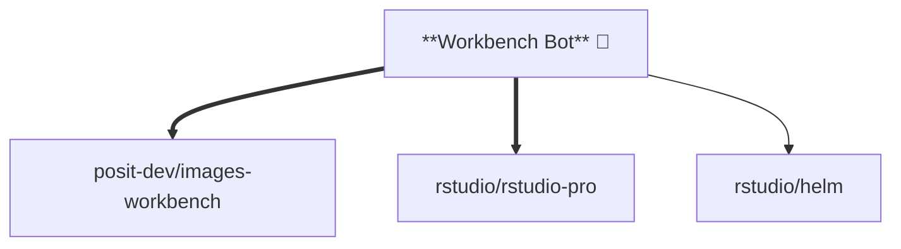
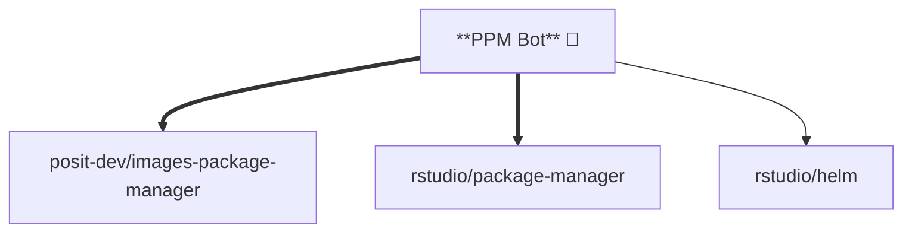
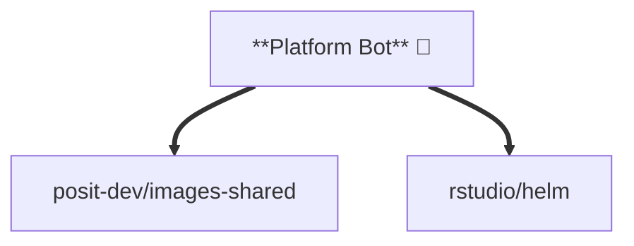
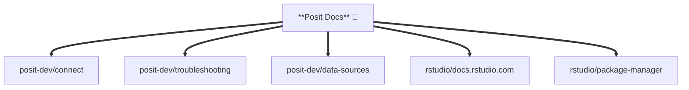

# github-apps

Manages GitHub App installations and org-level secret sharing for the Posit
container image ecosystem.

## What this manages

- **App installations**: Which repositories each GitHub App can access
- **Org-level secrets**: Created with `visibility: selected` and shared with
  the app's repositories

## What this does NOT manage

- **GitHub App creation**: Apps must be created via the GitHub UI or API.
  Once created, add the `installationId` to the stack config.
- **Secret values**: Secret values are created as placeholders and must be
  set out-of-band via `gh secret set` or the GitHub UI. Pulumi ignores
  changes to secret values after creation.

## Apps

| App | posit-dev repos | rstudio repos |
|---|---|---|
| connect-bot | connect, images-connect | helm (app only) |
| workbench-bot | images-workbench | rstudio-pro, helm (app only) |
| ppm-bot | images-package-manager | package-manager, helm (app only) |
| platform-bot | images-shared | helm |
| posit-docs | connect, troubleshooting, data-sources | docs.rstudio.com, package-manager |

| Line | Meaning |
|---|---|
| **Thick** (`==>`) | App installed + secrets shared |
| **Thin** (`-->`) | App installed only |

### Full Ecosystem



### Connect Bot



### Workbench Bot



### PPM Bot



### Platform Bot



### Posit Docs



## Usage

```bash
just setup
just preview posit-dev
just up posit-dev
just preview rstudio
just up rstudio
```

## Setting secret values

Pulumi creates the org-level secret resources and manages repo sharing.
Secret *values* are set via `gh secret set` to avoid storing credentials
in Pulumi state or git history:

```bash
gh secret set CONNECT_BOT_APP_ID --org posit-dev --body "<app-id>"
gh secret set CONNECT_BOT_APP_PRIVATE_KEY --org posit-dev < key.pem
```

The naming convention is `{APP_NAME}_{SECRET_NAME}`, e.g., `CONNECT_BOT_APP_ID`.

Run `pulumi up` first to create the resources, then `gh secret set` to
populate the values.

## Adding a new app

1. Create the GitHub App in the GitHub UI
2. Install it on the target org(s)
3. Add the app config to `Pulumi.{org}.yaml` with the `installationId`
4. Run `just up {org}`
5. Set secret values via `gh secret set`
